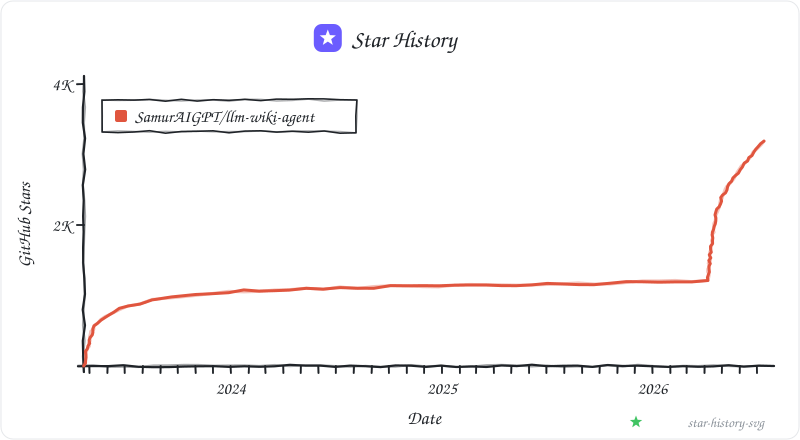

# LLM Wiki Agent

[](LICENSE)

**A coding agent skill.** Drop source documents into `raw/` and tell the agent to ingest them — it reads them, extracts knowledge, and builds a persistent interlinked wiki. Every new source makes the wiki richer. You never write it.

> Most knowledge tools make you search your own notes. This one reads everything you've collected and writes a structured wiki that compounds over time — cross-references already built, contradictions already flagged, synthesis already done.

```
ingest raw/papers/attention-is-all-you-need.md
```

```
wiki/
├── index.md          catalog of all pages — updated on every ingest
├── log.md            append-only record of every operation
├── overview.md       living synthesis across all sources
├── sources/          one summary page per source document
├── entities/         people, companies, projects — auto-created
├── concepts/         ideas, frameworks, methods — auto-created
└── syntheses/        query answers filed back as wiki pages
graph/
├── graph.json        persistent node/edge data (SHA256-cached)
└── graph.html        interactive vis.js visualization — open in any browser
```

## Related Projects

- [Open-Generative-AI](https://github.com/Anil-matcha/Open-Generative-AI) — Add AI image & video generation to your knowledge base pipeline
- [Open-AI-Design-Agent](https://github.com/Anil-matcha/Open-AI-Design-Agent) — Autonomous AI design agent — pair with wiki agent for research + visual output
- [AI-Voice-Agent](https://github.com/Anil-matcha/AI-Voice-Agent) — Self-hosted AI voice agent for real-time voice conversations, sales calls, and customer support

## Install

**Requires:** [Claude Code](https://claude.ai/code), [Codex](https://openai.com/codex), [Gemini CLI](https://github.com/google-gemini/gemini-cli), or any agent that reads a config file.

```bash
git clone https://github.com/SamurAIGPT/llm-wiki-agent.git
cd llm-wiki-agent
```

Open in your agent — no API key or Python setup needed:

```bash
claude      # reads CLAUDE.md + .claude/commands/ (slash commands available)
codex       # reads AGENTS.md
opencode    # reads AGENTS.md
gemini      # reads GEMINI.md
```

## Usage

All agents understand natural language and shorthand triggers:

```
ingest raw/papers/my-paper.md              # ingest a markdown source
ingest report.pdf                          # auto-converts in memory, then ingests
ingest slides.pptx notes.docx              # batch, mixed formats
python tools/project.py register /path/to/project --json  # register only; no scan
python tools/project.py inventory <project_id> --json       # accountable incremental Manifest
python -m tools.project event submit <project_id> --event-id evt-1 --producer codex --occurred-at 2026-07-16T09:00:00Z --operation modified --path src/model.py --json
python -m tools.project event show <project_id> --json       # validate/rebuild the dirty-path projection
python tools/raw_md.py /path/to/project     # legacy full-project raw-md evidence layer
query: what are the main themes?           # synthesize answer from wiki pages
lint                                       # find orphans, contradictions, gaps
build graph                                # build graph.html from all wikilinks
```

Plain English works too:
```
"Ingest this paper: raw/papers/llama2.md"
"What does the wiki say about attention mechanisms?"
"Check for contradictions across sources"
"Build the knowledge graph and tell me the most connected nodes"
```

**Claude Code** also provides `/wiki-ingest`, `/wiki-query`, `/wiki-lint`, `/wiki-graph` as slash commands (via `.claude/commands/`). These are Claude Code-specific — other agents use the natural language triggers above, which work identically.

Works with markdown, PDF, DOCX, PPTX, XLSX, HTML, TXT, CSV, JSON, XML, RST, EPUB, and more. Non-markdown files are auto-converted in memory via [markitdown](https://github.com/microsoft/markitdown) at ingest time — no adjacent `.md` sidecar is written.

## Project Wiki Layers

For a whole project directory, build a raw evidence layer first:

```bash
python tools/raw_md.py /path/to/project
```

Default output is written inside the input project:

```text
<project-name>-wiki/
  raw-md/
    primary/        # source-path mirror; one .md page per readable/input file
  wiki/             # curated knowledge layer maintained by the agent
    sources/        # source summaries, not raw file dumps
    entities/
    concepts/
    overview.md
  state/
    raw-md-manifest.json
  reports/
    raw-md-report.md
```

The layers have different jobs:

| Layer | Owner | Purpose |
|---|---|---|
| `raw-md/` | deterministic scripts | Raw evidence layer. Preserve source paths, hashes, metadata, code fences, converted document text, and metadata-only placeholders for binary/unsupported files. |
| `wiki/` | agent + user review | Curated knowledge layer. Summaries, entity pages, concept pages, overviews, contradictions, and saved syntheses. |
| `state/` / `reports/` | scripts and agents | Maintenance layer. Manifests, conversion reports, health reports, graph reports. |

Daily answers should start from the curated `wiki/` layer. For exact values, implementation details, disputed claims, or anything that depends on source fidelity, the agent should trace back to `raw-md/` and use it as the evidence layer. Do not bulk-copy every raw-md page into `wiki/sources/`; `wiki/sources/` remains a curated summary layer.

## Project-Scoped Research Storage

Schema v1 separates local machine state from curated research knowledge:

```text
.llmwiki/projects/<project_id>/   # manifests, extracted evidence, indexes, runs
wiki/projects/<project_id>/       # overviews, papers, experiments, claims, plans
```

Register an external research project without scanning or modifying it:

```bash
python tools/project.py register /path/to/project --json
```

The command normalizes the source path, generates a stable path-based `project_id`, writes Schema v1 `project.yaml`, records local Git metadata, and creates empty project-scoped storage. Repeat registration is idempotent. Use `--knowledge-root /path/to/knowledge/projects` to keep curated Markdown in a personal knowledge base; the command appends `<project_id>/` automatically. The machine workspace and knowledge root must remain outside the source project.

Generated project state is ignored by Git by default because it may contain local paths and derived indexes. Human-readable knowledge remains version-controlled. Existing `<project-name>-wiki/` raw-md outputs continue to work through an explicit legacy compatibility layer; no command silently migrates or deletes them. Structured machine records use `schema_version`, with unversioned records treated as legacy v0 and unsupported future versions rejected.

See `docs/project-storage-layout.md` for the registration, storage, and compatibility rules.

B-02 provides a deterministic, source-read-only scan-policy core. It reads an optional project `.llmwikiignore`, layers explicit include/exclude rules, keeps protected VCS/Core state excluded, applies size and sensitive-path controls, defaults Research Core external sends to `local-only`, and returns explainable path, raw-content, external-send, and symlink decisions. See `docs/scan-policy.md`.

Create or incrementally refresh the Manifest for an already registered project:

```bash
python tools/project.py inventory <project_id> --json
```

The inventory preserves B-03 accountability for every in-scope regular file, excluded file, pruned-directory boundary, and symbolic link. B-04 adds scan generation, local SHA-256, size, mtime, and conservative fingerprint reuse. B-05 adds deterministic format, language, research-role, and reason fields. B-06 writes the current `project-inventory-v4` artifact and gives every ordinary file a versioned two-axis state (`processing_status` + `read_depth`) with a stable reason code and explanation; inventory results remain honestly `discovered`, while sampled, metadata-only, ignored, and unsupported files stay distinguishable. B-02 still gates bounded classification-prefix reads, and nothing is sent to an LLM or written back to the source project. Coverage/failure reporting remains B-08. See `docs/project-inventory.md`, `docs/file-fingerprints.md`, `docs/file-classification.md`, and `docs/manifest-file-state.md`.

## Research Assistant Evolution (In Development)

The `research-assistant` branch is evolving this repository into a local-first, evidence-grounded research workspace that integrates with host agents such as Codex and Claude Code. The target includes one-click project understanding, 15 Markdown research artifacts, source-level evidence, incremental reconciliation, cross-project knowledge, daily planning, and a rebuildable local web dashboard. These are roadmap targets, not claims about the current release.

- [Final product and scan-output contract](docs/research-assistant-product-contract.md)
- [Minimum-scope implementation roadmap](docs/research-assistant-roadmap.md)
- [Host-neutral Research Core service](docs/research-core-service.md)
- [Deterministic one-action project understanding](docs/project-understand.md)
- [Minimal MCP stdio server](docs/research-mcp-server.md)
- [B-02 explainable scan-policy contract](docs/scan-policy.md)

- [B-03 project inventory and accountable directory contract](docs/project-inventory.md)
- [B-04 file fingerprints and incremental Manifest contract](docs/file-fingerprints.md)
- [B-05 deterministic file classification contract](docs/file-classification.md)
- [B-06 Manifest two-axis file-state contract](docs/manifest-file-state.md)

The current deterministic one-action prefix can be run from an empty
assistant workspace with:

```bash
python -B -m tools.project understand /path/to/research-project \
  --workspace-root /path/to/assistant-workspace --json
```

This currently performs only `register -> inventory -> classify`, persists a
resumable run report, and leaves later stages pending. It does **not** yet
produce the 15-artifact package or local Web dashboard and has no `--open`
option.

Registered projects also accept host-neutral file-change signals through the
append-only H-04 event ledger. `event submit` records an idempotent event under
`.llmwiki/projects/<project_id>/events.jsonl`; `event show` validates that ledger
and deterministically repairs `indexes/dirty-paths.json`. These signals do not
scan source files, mutate curated knowledge, or claim reconciliation. See
[`docs/host-event-ledger.md`](docs/host-event-ledger.md).

The current R2 transport can be started for any MCP-capable host with:

```bash
python -B -m tools.research_mcp --workspace-root /path/to/assistant-workspace
```

Project context, coverage, and source-open are real Core calls. MCP results use
path-free host DTOs; every advertised input/output JSON Schema is enforced;
coverage persists deterministic machine state and is not marked read-only; and
source-open denies Manifest-sensitive or otherwise content-restricted files. The
default `local-only` external-send mode still permits explicit local host access
to ordinary policy-authorized files. Query, reconciliation, and planning
advertise stable contracts but fail explicitly as unavailable until their
corresponding roadmap slices are implemented.

## What You Get

**Persistent wiki** — structured markdown pages that accumulate across sessions. Unlike chat, nothing is lost.

**Entity pages** — auto-created for every person, company, or project mentioned across sources. Updated each time a new source references them.

**Concept pages** — auto-created for every key idea or framework. Cross-referenced to every source that discusses them.

**Living overview** — `wiki/overview.md` is revised on every ingest to reflect the current synthesis across everything you've read.

**Contradiction flags** — when a new source contradicts an existing claim, it's flagged at ingest time, not buried until query time.

**Knowledge graph** — `graph.html` shows every wiki page as a node, every `[[wikilink]]` as an edge, and Claude-inferred implicit relationships as dotted edges. Community detection clusters related topics.

**Lint reports** — orphan pages, broken links, missing entity pages, data gaps with suggested sources to fill them.

## Use Cases

### Research

Going deep on a topic over weeks — reading papers, articles, reports.

```
/wiki-ingest raw/papers/attention-is-all-you-need.md
/wiki-ingest raw/papers/llama2.md
/wiki-ingest raw/papers/rag-survey.md

# Wiki builds entity pages (Meta AI, Google Brain) and
# concept pages (Attention, RLHF, Context Window) automatically.

/wiki-query "What are the main approaches to reducing hallucination?"
/wiki-query "How has context window size evolved across models?"

/wiki-lint
# → "No sources on mixture-of-experts — consider the Mixtral paper"
```

By the end you have a structured, interlinked reference — not a folder of PDFs you'll never reopen.

---

### Reading a Book

File each chapter as you go. Build out pages for characters, themes, arguments.

```
/wiki-ingest raw/book/chapter-01.md
/wiki-ingest raw/book/chapter-02.md

# Wiki creates entity and theme pages automatically.

/wiki-query "How has the protagonist's motivation evolved?"
/wiki-query "What contradictions exist in the author's argument so far?"

/wiki-graph   # → graph.html shows every character/theme and how they connect
```

Think fan wikis like Tolkien Gateway — built as you read, with the agent doing all the cross-referencing.

---

### Personal Knowledge Base

Track goals, health, habits, self-improvement — file journal entries, articles, podcast notes.

```
/wiki-ingest raw/journal/2026-01-week1.md
/wiki-ingest raw/articles/huberman-sleep-protocol.md
/wiki-ingest raw/articles/atomic-habits-summary.md

/wiki-query "What patterns show up in my journal entries about energy?"
/wiki-query "What habits have I tried and what was the outcome?"
```

The wiki builds a structured picture over time. Concepts like "Sleep", "Exercise", "Deep Work" accumulate evidence from every source filed.

---

### Business / Team Intelligence

Feed in meeting transcripts, project docs, customer calls.

```
/wiki-ingest raw/meetings/q1-planning-transcript.md
/wiki-ingest raw/docs/product-roadmap-2026.md
/wiki-ingest raw/calls/customer-interview-acme.md

/wiki-query "What feature requests have come up most across customer calls?"
/wiki-query "What decisions were made in Q1 and what was the rationale?"

/wiki-lint
# → "Project X mentioned in 5 pages but no dedicated page"
# → "Roadmap contradicts customer interview on priority of feature Y"
```

The wiki stays current because the agent does the maintenance no one wants to do.

---

### Competitive Analysis

Track a company, market, or technology over time.

```
/wiki-ingest raw/competitors/openai-announcements.md
/wiki-ingest raw/market/ai-funding-report-q1.md

/wiki-query "How do OpenAI and Anthropic differ on safety approach?"
/wiki-query "Which companies announced multimodal models in the last 6 months?"
/wiki-query "Competitive landscape summary as of today"
# → agent shows the answer, then asks if you want to save it as a synthesis page
```

## The Graph

Two-pass build:

1. **Deterministic** — parses all `[[wikilinks]]` across wiki pages → edges tagged `EXTRACTED`
2. **Semantic** — agent infers implicit relationships not captured by wikilinks → edges tagged `INFERRED` (with confidence score) or `AMBIGUOUS`

Louvain community detection clusters nodes by topic. SHA256 cache means only changed pages are reprocessed. Output is a self-contained `graph.html` — no server, opens in any browser.

## CLAUDE.md / AGENTS.md

The schema file tells the agent how to maintain the wiki — page formats, ingest/query/lint/graph workflows, naming conventions. This is the key config file. Edit it to customize behavior for your domain.

| Agent | Schema file |
|---|---|
| Claude Code | `CLAUDE.md` |
| Codex / OpenCode | `AGENTS.md` |
| Gemini CLI | `GEMINI.md` |

## What Makes This Different from RAG

| RAG | LLM Wiki Agent |
|---|---|
| Re-derives knowledge every query | Compiles once, keeps current |
| Raw chunks as retrieval unit | Structured wiki pages |
| No cross-references | Cross-references pre-built |
| Contradictions surface at query time (maybe) | Flagged at ingest time |
| No accumulation | Every source makes the wiki richer |

## Obsidian Integration

The wiki is designed to be browsed seamlessly in [Obsidian](https://obsidian.md). Since the agent maintains consistent `[[wikilinks]]`, you get a naturally growing knowledge graph in your vault.

### Vault Symlink Pattern
If you want to keep the LLM Wiki Agent repository separate from your main personal vault, use symlinks:
1. Keep your working agent repository at e.g., `~/llm-wiki-agent`
2. Create a symlink from your main Obsidian vault:
   ```bash
   ln -sfn ~/llm-wiki-agent/wiki ~/your-obsidian-vault/wiki
   ```
3. Use the [Obsidian Web Clipper](https://obsidian.md/clipper) or write directly to `raw/` in the agent repo to queue items for ingestion.

> **Note:** If you ever move your local repo directory, remember to update the symlink, otherwise the `wiki/` directory will appear missing in Obsidian.

### Recommended .obsidian Config
- **Graph View:** Filter out `index.md` and `log.md` (e.g. `-file:index.md -file:log.md`) to avoid them becoming gravity wells in your Obsidian graph.
- **Dataview:** Use the community plugin [Dataview](https://blacksmithgu.github.io/obsidian-dataview/) to query the YAML frontmatter the agent automatically injects (e.g., `type: source`, `tags: [diary]`).

## Multi-Format Ingest

For whole-project initialization, prefer `python tools/raw_md.py <project-root>` first. That command creates a non-destructive raw evidence layer under `<project-name>-wiki/raw-md/`; `ingest` then remains the curated workflow that turns selected evidence into `wiki/sources/`, entities, concepts, and overview pages.

Drop any supported file directly into `ingest` — no separate conversion step needed:

```bash
# These all work — auto-converted in memory at ingest time
ingest report.pdf
ingest meeting-notes.docx
ingest slides.pptx
ingest data.xlsx
ingest page.html
ingest raw/mixed-folder/          # recursively finds all supported files
```

**Supported formats:**
`.md` `.pdf` `.docx` `.pptx` `.xlsx` `.xls` `.html` `.htm` `.txt` `.csv` `.json` `.xml` `.rst` `.rtf` `.epub` `.ipynb` `.yaml` `.yml` `.tsv` `.wav` `.mp3`

Non-markdown files are auto-converted in memory via [markitdown](https://github.com/microsoft/markitdown). Use `--no-convert` to skip auto-conversion and process only `.md` files. Ingest does not write converted `.md` files beside source files.

### arXiv Papers (Advanced)

For arXiv papers, use `tools/pdf2md.py` for higher-fidelity conversion:

```bash
python tools/pdf2md.py 2401.12345                      # by arXiv ID
python tools/pdf2md.py https://arxiv.org/abs/2401.12345 # by URL
python tools/pdf2md.py paper.pdf --backend marker       # complex multi-column PDFs
```

Then ingest the resulting `.md`:
```
ingest raw/papers/my-paper.md
```

### Batch Directory Conversion (Advanced)

For safe whole-directory conversion, use raw-md output:
```bash
python tools/file_to_md.py --input_dir raw/imports/
```

`tools/file_to_md.py` is now a compatibility wrapper around `tools/raw_md.py` by default. It never modifies source files in safe mode. The old adjacent-file behavior is still available only when explicitly requested:

```bash
python tools/file_to_md.py --input_dir raw/imports/ --legacy-adjacent-output
python tools/file_to_md.py --input_dir raw/imports/ --legacy-adjacent-output --delete_source --allow-delete-source
```

Use the delete form only for deliberate one-off migrations. It is not part of the recommended raw evidence workflow.

### Optional Dependencies

| Package | Install | Used for |
|---|---|---|
| [markitdown](https://github.com/microsoft/markitdown) | `pip install "markitdown[all]"` | Auto-conversion of document formats for ingest and raw-md |
| [arxiv2md](https://github.com/ryansingman/arxiv2md) | `pip install arxiv2markdown` | arXiv papers via structured source |
| [Marker](https://github.com/VikParuchuri/marker) | `pip install marker-pdf` | Complex academic PDFs with multi-column layouts |
| [PyMuPDF4LLM](https://github.com/pymupdf/RAG) | `pip install pymupdf4llm` | Fast PDF extraction (no GPU needed) |
| [tqdm](https://github.com/tqdm/tqdm) | `pip install tqdm` | Progress bar for batch directory conversion |

## Tips

- For a mixed code/document project, run `python tools/raw_md.py <project-root>` before asking the agent to summarize; use `raw-md/` for evidence and `wiki/` for curated knowledge.

- Just drop files (PDF, DOCX, etc.) into `raw/` and `ingest` them; conversion is automatic and happens in memory.
- For arXiv papers, `tools/pdf2md.py` gives higher-fidelity output than generic markitdown conversion
- Query answers are shown first — the agent then asks if you want to file them as synthesis pages. Your explorations compound just like ingested sources
- The wiki is a git repo — version history for free
- Standalone Python scripts in `tools/` work without a coding agent (require `ANTHROPIC_API_KEY`)

## Tech Stack

NetworkX + Louvain + Claude + vis.js. No server, no database, runs entirely locally. Everything is plain markdown files.

## Related

- [graphify](https://github.com/safishamsi/graphify) — graph-based knowledge extraction skill (inspiration for the graph layer)
- [Vannevar Bush's Memex (1945)](https://en.wikipedia.org/wiki/Memex) — the original vision this resembles

## Star History

[](https://github.com/SamurAIGPT/llm-wiki-agent/stargazers)

## License

MIT License — see [LICENSE](LICENSE) for details.
